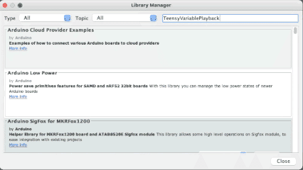
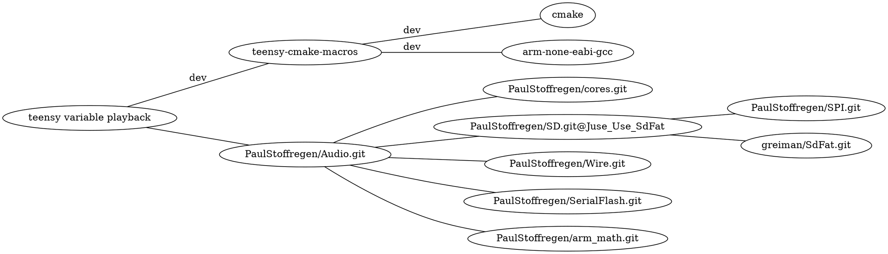

# Variable rate playback for Teensy Audio library
[](https://www.pjrc.com/store/teensy41.html)
[](https://github.com/newdigate/teensy-variable-playback/actions/workflows/teensy41_lib.yml)
[](https://github.com/newdigate/teensy-variable-playback/actions)
[](LICENSE)
[](CMakelists.txt)
[](https://github.com/newdigate/teensy-variable-playback/graphs/contributors) 
[](https://github.com/newdigate/teensy-variable-playback/graphs/contributors)


Play 16-bit PCM RAW or WAV audio samples at variable playback rates on Teensy
* **Note** : this library only works with signed 16-bit integer samples. Floating point samples will not play. 

* for best performance, use SDXC UHS 30MB/sec Application Performance Class 2 (A2) class micro SD-card. 
  * [SD classes on wikipedia](https://en.wikipedia.org/wiki/SD_card#cite_ref-93) 

## contents
* [code structure](#code-structure)
* [requirements](#requirements)
* [usage](#usage)
* [example usage](#example-usage)
* [updates](#updates)

## code structure
| folder | target             | description                                                                                                            |
|--------|--------------------|------------------------------------------------------------------------------------------------------------------------|
| ```examples```    | ```teensy``` | basic example how to use  |
| ```extras```    | ```linux``` | some utils to make life easier  |
| ```src```    | ```teensy``` / ```linux``` | extends teensy audio library<br/> * adds ```AudioPlaySdResmp``` <br/> * adds ```AudioPlayArrayResmp```   |
| ```test```   | ```linux```          | unit tests that run on linux |

## requirements
<details>
  <summary>teensy 3.x & 4.x boards</summary>
 
  
<details>
  <summary>with Teensyduino</summary>  

```Teensyduino```[^](https://www.pjrc.com/teensy/teensyduino.html)
* This library is built on top of Teensy Audio library,  intended for use with Teensy 3.x and Teensy 4.x boards.
* Install using arduino/teensyduino library manager gui - search ```TeensyVariablePlayback```
  * 
</details>
    
  
<details>
  <summary>build for teensy with cmake and gcc-arm-none-eabi</summary>  
* required software
    ```cmake``` [gcc-arm-none-eabi](https://developer.arm.com/-/media/Files/downloads/gnu-rm/9-2019q4/RC2.1) 
  * remember to update ```COMPILERPATH``` in ```cmake\toolchains\teensy41.cmake``` to  ```gcc-arm-none-eabi\bin``` folder 

<details>
  <summary>dependencies (click to expand image) </summary>
  

  
<details>
  <summary>graphvis (click to expand) </summary>
  

</details>
  
</details>  
  
  
  
</details>
  
  

  
</details>

<details>
  <summary>linux</summary>
  You can run and test this code on your linux computer. You can write a teensy sketch, and with a few modifications, you can redirect the audio input and output to and from your soundcard. [Soundio](https://github.com/newdigate/teensy-audio-x86-stubs/tree/main/extras/soundio) bindings are optional, you can also run sketches and tests with no audio input or output.
  You will need to install the following libraries.
  
  ```cmake``` ```libsoundio``` ```gcc or llvm``` ```boost-test``` 

  * install boost unit-test library: 
    * linux: ```sudo apt-get install -yq libboost-test-dev```
    * macos: ```brew install boost```
  * install soundio
    * linux: ```sudo apt-get install -yq libsoundio-dev``` 
    * macos: ```brew install libsoundio```

</details>  
  

## usage 
<details>
  <summary>Using with Teensyduino</summary>
  
* To install the library, use the library manager in Teensyduino (search for ```TeensyVariablePlayback```). Teensyduino should already have all the necessary dependencies pre-installed. 

* Have a look at the examples in the file menu to get started...
</details>

<details>
  <summary>Developing with vscode</summary>

  * [Visual Studio Code](https://code.visualstudio.com)
  
### clone repo
``` sh
> git clone https://github.com/newdigate/teensy-variable-playback.git
> cd teensy-variable-playback
```

## teensy build

<details>
  <summary>update COMPILERPATH and DEPSPATH in cmake/toolchains/teensy41.cmake</summary>
  
``` cmake
set(COMPILERPATH "/Applications/Arm/bin/")
```

</details>

<details>
  <summary>build hex file</summary>

  * If you run the commands below from the root repository directory, it will build the teensy-variable-playback library and all the examples. 
  * If you run them from a sub-directory, it will build everything under the sub-directory. (You might need to adjust relative path in ```-DCMAKE_TOOLCHAIN_FILE:FILEPATH``` below)
``` sh
> cd /home/nic/teensy-variable-playback
> mkdir cmake-build-debug
> cd cmake-build-debug
> cmake -DCMAKE_BUILD_TYPE=Debug -DCMAKE_TOOLCHAIN_FILE:FILEPATH="../cmake/toolchains/teensy41.cmake" ..
> make
```

</details>

## linux build
### build tests on linux
``` sh
> ./build-linux.sh
```

### build tests on win
``` sh
> mkdir cmake-build-debug
> cd cmake-build-debug
> cmake -DCMAKE_BUILD_TYPE=Debug ..
> cmake --build .
```

### run tests
``` sh
> cmake-build-debug/test/test_suite1
```

## visual studio code
  * download vs code
    * required extensions
      * ms-vscode.cpptools
    * optional extensions
      * ms-vscode.cmake-tools
      * hbenl.vscode-test-explorer
      * ms-vscode.test-adapter-converter
      * nicnewdigate.boost-test-adapter-debug
  * open root folder of repository in visual studio code
  * open terminal in visual studio code build, build as above
  * (add breakpoint)
  * launch

</details>

## example usage

<details>
  <summary>example (click to expand) </summary>
  
```c++
#include <Arduino.h>
#include <Audio.h>
#include <TeensyVariablePlayback.h>

// GUItool: begin automatically generated code
AudioPlayArrayResmp      rraw_a1;        //xy=321,513
AudioOutputI2S           i2s1;           //xy=675,518
AudioConnection          patchCord1(rraw_a1, 0, i2s1, 0);
AudioConnection          patchCord2(rraw_a1, 0, i2s1, 1);
AudioControlSGTL5000     sgtl5000_1;     //xy=521,588
// GUItool: end automatically generated code

unsigned char kick_raw[] = {
  // ... little-endian 16-bit mono 44100 raw data, generated using linux cmd 'xxd -i kick.raw', raw file saved in Audacity
  0x99, 0x02, 0xd7, 0x02, 0xfa, 0x02, 0x5f, 0x03, 0xc1, 0x03, 0x2a, 0x04,
  0xad, 0x04, 0xa5, 0x05, 0x76, 0x06, 0x2f, 0x07, 0x9e, 0x07, 0xe2, 0x07,
  0x43, 0x08, 0x92, 0x08, 0xb2, 0x08, 0xe8, 0x08, 0x16, 0x09, 0xda, 0x08,
  // ... continued ... 
};
unsigned int kick_raw_len = 6350; // length in bytes == numsamples * 2

void setup() {
    AudioMemory(20);
    sgtl5000_1.enable();
    sgtl5000_1.volume(0.5f, 0.5f);
    rraw_a1.setPlaybackRate(0.5);
    rraw_a1.enableInterpolation(true);  
}

void loop() {
    if (!rraw_a1.isPlaying()) {
        delay(1000);
        rraw_a1.playRaw((int16_t *)kick_raw, kick_raw_len/2, 1);  //note: we give number of samples - NOT number of bytes!!!! 1 is for mono (2 for stereo, etc)
    }
}
```
  
</details>  

## updates
<details>
  <summary>updates</summary>
* 2025-02-20: build for teensy/linux without needing to install dependencies, using CMake FetchContent to pull project-relative dependencies
* 2025-02-02: v1.1.0
  * wide-ranging changes to allow more robust playback of multiple files
    * buffers in heap or PSRAM, re-loaded by EventResponder rather than in interrupt
    * mechanism to prevent attempted simultaneous filesystem accesses from playback and user code
  * examples added: PlayPiano and FileAccess
  * start playback at arbitrary point in file (`play_start::play_start_arbitrary`)
  
* 26/02/2022: v1.0.16:
  * add option for starting sample at beginning or at loop start
  ``` c
  typedef enum play_start {
      play_start_sample,
      play_start_loop,
  };

  wave.setPlayStart(play_start::play_start_loop); 
  ```
* 26/02/2022: v1.0.15:
  * added support for dual playback head for seamless looping
    * enable dual playback using linear crossfading
    * set crossfade duration in number of samples
  ``` c
        AudioPlaySdResmp         wave;      
        wave.setUseDualPlaybackHead(true);
        wave.setCrossfadeDurationInSamples(1000);
        wave.playRaw((int16_t*)kick_raw, kick_raw_len / 2, numberOfChannels);
        wave.setLoopStart(0); 
        wave.setLoopFinish(3000);
  ```
* 16/06/2022: v1.0.14: 
  * refactored code to generic classes
  * improve memory leaks
  * remove calls to StartUsingSPI(), StopUsingSPI(), __disable_irq(), __enable_irq()
  * integrated with SerialFlash and LittleFS 
* 25/09/2021: v1.0.13: positionMillis() implemented for AudioPlaySdResmp
* 25/08/2021: v1.0.12: Skip over RIFF tags in .wav header
* 12/08/2021: v1.0.11: When playing a mono sample, transmit on both channels (credit to @atoktoto) 
* 28/07/2021: v1.0.10: Fix issues when starting playback in reverse
* 23/07/2021: v1.0.9: Fix issue which crashes teensy when playing multiple files from SD card using array of filenames
* 21/07/2021: v1.0.8: **Breaking changes** 
  * ```AudioPlaySdRawResmp``` and ```AudioPlaySdWaveResmp``` merged into a single class ```AudioPlaySdResmp```
  * ```play(...)``` method changed to ```playRaw(...)``` and ```playWav(...)```, specify number of channels in parameters of playRaw
* 13/07/2021: v1.0.7: added multi-channel resampling
* 07/07/2021: v1.0.6: changed to using optimised floating point interpolation, sounds much better
* 30/06/2021: v1.0.5: Optimised quadratic interpolation to use fixed pipeline of 4 samples and use integers instead of floating point
* 25/06/2021: Quadratic interpolation is now working, but is disabled by default
</details>

# credits
* convert boost test report to junit xml format: [Stuart Lange](https://stackoverflow.com/a/2975928/4634140)
