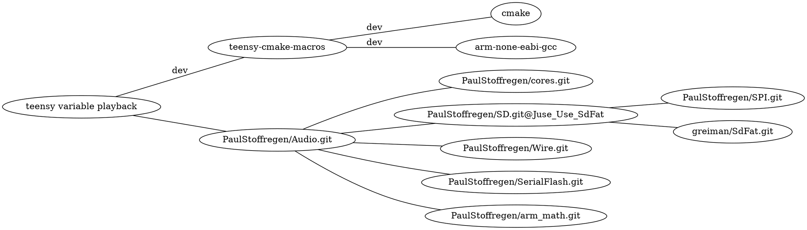

# variable rate playback for teensy audio library
[](https://www.pjrc.com/store/teensy40.html)
[](https://github.com/newdigate/teensy-variable-playback/actions/workflows/teensy41_lib.yml)
[](https://github.com/newdigate/teensy-variable-playback/actions)
[](LICENSE)
[](CMakelists.txt)
[](https://code.visualstudio.com/)

play 16-bit mono .raw and .wav audio at variable playback rates on teensy

## contents
* [requirements](#requirements)
* [code structure](#code-structure)
* [download](#download)
* [teensy build](#teensy-build)
* [linux build](#linux-build)
* [visual studio code](#visual-studio-code)
* [todo](#todo)

## requirements  
### teensy   
  * cmake
  * [gcc-arm-none-eabi](https://developer.arm.com/-/media/Files/downloads/gnu-rm/9-2019q4/RC2.1)
  * github
    * newdigate
      * [teensy-cmake-macros](https://github.com/newdigate/teensy-cmake-macros)
      ```shell
      > git clone https://github.com/newdigate/teensy-cmake-macros.git
      > cd teensy-cmake-macros
      > mkdir cmake-build-debug
      > cd cmake-build-debug
      > cmake ..
      > sudo make install        
      ```

    * PaulStoffregen
      * [cores.git](https://github.com/PaulStoffregen/cores)
      * [Audio.git](https://github.com/PaulStoffregen/Audio)
      * [SD.git @ Juse_Use_SdFat](https://github.com/PaulStoffregen/SD/tree/Juse_Use_SdFat)
      * [Wire.git](https://github.com/PaulStoffregen/Wire)
      * [SPI.git](https://github.com/PaulStoffregen/SPI)
      * [SerialFlash.git](https://github.com/PaulStoffregen/SerialFlash)
      * [arm_math.git](https://github.com/PaulStoffregen/arm_math)
    * greiman
      * [SdFat.git](https://github.com/greiman/SdFat)

### linux 
By using stub libraries, we can compile teensy code to native device architecture. To a certain extent, this allows sketches and libraries to be developed, debugged and unit-tested using linux, on your local device or a build server. In this case I have a few basic tests for the ResamplingSdReader class.
  * cmake
  * gcc or llvm: c++ standard library (using std::vector, std::function)
  * [newdigate](https://github.com/newdigate)
    * [teensy-x86-stubs](https://github.com/newdigate/teensy-x86-stubs)
    * [teensy-audio-x86-stubs](https://github.com/newdigate/teensy-audio-x86-stubs)
    * [teensy-x86-sd-stubs](https://github.com/newdigate/teensy-x86-sd-stubs)
  * boost unit-test library: 
    * linux: ```sudo apt-get install -yq libboost-test-dev```
    * macos: ```brew install boost```



        
## code structure
| folder | target             | description                                                                                                            |
|--------|--------------------|------------------------------------------------------------------------------------------------------------------------|
| ```examples```    | ```teensy/linux``` | basic example how to use  |
| ```src```    | ```teensy/linux``` | extends teensy audio library<br/> * adds ```AudioPlaySdRawResmp```<br/> * play raw audio at variable forward and backward playback rates     |
| ```test```   | ```linux```          | unit tests that run on linux |
  
## download 
### clone repo
``` sh
> git clone https://github.com/newdigate/teensy-variable-playback.git
> cd teensy-variable-playback
```
## teensy build
* manual configuration steps required:
  * update ```cmake/toolchains/teensy41.cmake```:
 ``` cmake
set(COMPILERPATH "/Applications/Arm/bin/")
set(DEPSPATH "/Applications/Teensyduino.app/Contents/Java/hardware/teensy/avr/libraries")
set(COREPATH "/Applications/Teensyduino.app/Contents/Java/hardware/teensy/avr/cores/teensy4/")
```
* 
``` sh
> mkdir cmake-build-debug
> cd cmake-build-debug
> cmake -DCMAKE_BUILD_TYPE=Debug -DCMAKE_TOOLCHAIN_FILE:FILEPATH="../cmake/toolchains/teensy41.cmake" ..
> make
```

* for best performance, use SDXC UHS 30MB/sec Application Performance Class 2 (A2) class micro sd-card. 
  * [sd classes on wikipedia](https://en.wikipedia.org/wiki/SD_card#cite_ref-93) 

## linux build
### build tests on linux
``` sh
> ./build-linux.sh
```

### build tests on win
``` sh
> mkdir cmake-build-debug
> cd cmake-build-debug
> cmake -DCMAKE_BUILD_TYPE=Debug -DCMAKE_TOOLCHAIN_FILE:FILEPATH="../cmake/toolchains/linux.cmake" ..
> make
```

### run tests
``` sh
> cmake-build-debug/test/test_suite1
```

## visual studio code
  * download vs code
    * install plug-in ms-vscode.cpptools
  * open root folder of repository in visual studio code
  * open terminal in visual studio code build, build as above
  * (add breakpoint)
  * launch

## todo
* stereo  
