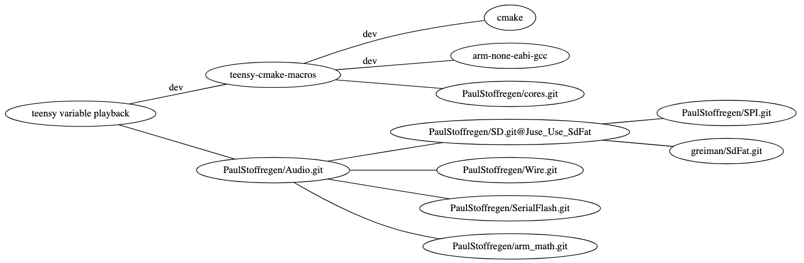
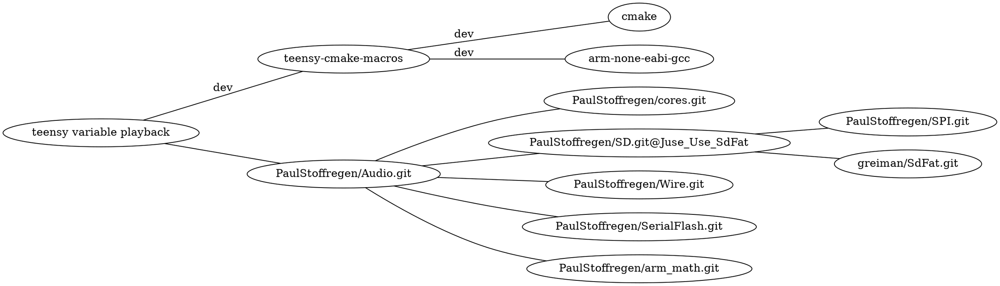

# variable rate playback for teensy audio library
[](https://www.pjrc.com/store/teensy40.html)
[](https://github.com/newdigate/teensy-variable-playback/actions)
[](https://github.com/newdigate/teensy-variable-playback/actions)
[](LICENSE)
[](CMakelists.txt)
[](https://code.visualstudio.com/)
[![made with JetBrains Clion](https://img.shields.io/badge/project-Clion-brightgreen.svg?label=Made%20for&colorA=555555&colorB=ff8a2c&logo=data%3Aimage%2Fsvg%2Bxml%3Bbase64%2CPD94bWwgdmVyc2lvbj0iMS4wIiBlbmNvZGluZz0idXRmLTgiPz48c3ZnIHZlcnNpb249IjEuMSIgaWQ9IkxheWVyXzEiIHhtbG5zPSJodHRwOi8vd3d3LnczLm9yZy8yMDAwL3N2ZyIgeG1sbnM6eGxpbms9Imh0dHA6Ly93d3cudzMub3JnLzE5OTkveGxpbmsiIHg9IjBweCIgeT0iMHB4IiB3aWR0aD0iMTRweCIgaGVpZ2h0PSIxNHB4IiB2aWV3Qm94PSIwIDAgMTQgMTQiIGVuYWJsZS1iYWNrZ3JvdW5kPSJuZXcgMCAwIDE0IDE0IiB4bWw6c3BhY2U9InByZXNlcnZlIj48cmVjdCB4PSIxIiB5PSIxMiIgZmlsbD0iI0ZGRkZGRiIgd2lkdGg9IjciIGhlaWdodD0iMSIvPjxwYXRoIGZpbGw9IiNGRkZGRkYiIGQ9Ik0wLjMsNy4zbDEtMS4xYzAuNCwwLjUsMC44LDAuNywxLjMsMC43YzAuNiwwLDEtMC40LDEtMS4yVjFoMS42djQuN2MwLDAuOS0wLjIsMS41LTAuNywxLjlDNC4xLDguMSwzLjQsOC40LDIuNiw4LjRDMS41LDguNCwwLjgsNy45LDAuMyw3LjN6Ii8%2BPHBhdGggZmlsbD0iI0ZGRkZGRiIgZD0iTTYuOCwxaDMuNGMwLjgsMCwxLjUsMC4yLDEuOSwwLjZjMC4zLDAuMywwLjUsMC43LDAuNSwxLjJsMCwwYzAsMC44LTAuNCwxLjMtMSwxLjZDMTIuNSw0LjgsMTMsNS4zLDEzLDYuMmwwLDBjMCwxLjMtMS4xLDItMi43LDJINi44VjF6IE0xMSwzLjFjMC0wLjUtMC40LTAuNy0xLTAuN0g4LjR2MS41aDEuNUMxMC42LDMuOSwxMSwzLjcsMTEsMy4xTDExLDMuMXogTTEwLjIsNS4zSDguNHYxLjZoMS45YzAuNywwLDEuMS0wLjIsMS4xLTAuOGwwLDBDMTEuNCw1LjYsMTEuMSw1LjMsMTAuMiw1LjN6Ii8%2BPHJlY3QgeD0iMSIgeT0iMTIiIGZpbGw9IiNGRkZGRkYiIHdpZHRoPSI3IiBoZWlnaHQ9IjEiLz48L3N2Zz4%3D)](https://www.jetbrains.com/clion/)

A set of classes to read and play 16-bit raw mono audio from micro sd-card at variable forward and backward playback rates on teensy
* for best performance, use SDXC UHS 30MB/sec Application Performance Class 2 (A2) class micro sd-card. 
  * [sd classes on wikipedia](https://en.wikipedia.org/wiki/SD_card#cite_ref-93) 

## todo
* improve looping controls, allow xm-tracker like sample looping, 
  * loop start and finish markers, ping ponging, repeating, etc.
* stereo  

## requirements
  * x86 / x64 linux unit tests
    * cmake
    * gcc or llvm: c++ standard library (using std::vector, std::function)
    * [newdigate](https://github.com/newdigate)
      * [teensy-x86-stubs](https://github.com/newdigate/teensy-x86-stubs)
      * [teensy-audio-x86-stubs](https://github.com/newdigate/teensy-audio-x86-stubs)
      * [teensy-x86-sd-stubs](https://github.com/newdigate/teensy-x86-sd-stubs)
    * boost unit-test library: ```sudo apt-get install -yq libboost-test-dev```
    
  * teensy variable playback library  
    * cmake
    * [gcc-arm-none-eabi](https://developer.arm.com/-/media/Files/downloads/gnu-rm/9-2019q4/RC2.1): for cross-compiling to arm cortex m7 architecture (for teensy 4.0)
    * github
      * newdigate
        * [teensy-cmake-macros](https://github.com/newdigate/teensy-cmake-macros)
        ```shell
        > git clone https://github.com/newdigate/teensy-cmake-macros.git
        > cd teensy-cmake-macros
        > mkdir cmake-build-debug
        > cd cmake-build-debug
        > cmake ..
        > sudo make install        
        ```

      * PaulStoffregen
        * [cores.git](https://github.com/PaulStoffregen/cores)
        * [Audio.git](https://github.com/PaulStoffregen/Audio)
        * [SD.git @ Juse_Use_SdFat](https://github.com/PaulStoffregen/SD/tree/Juse_Use_SdFat)
        * [Wire.git](https://github.com/PaulStoffregen/Wire)
        * [SPI.git](https://github.com/PaulStoffregen/SPI)
        * [SerialFlash.git](https://github.com/PaulStoffregen/SerialFlash)
        * [arm_math.git](https://github.com/PaulStoffregen/arm_math)
      * greiman
        * [SdFat.git](https://github.com/greiman/SdFat)




        
## code structure

| folder | target             | description                                                                                                            |
|--------|--------------------|------------------------------------------------------------------------------------------------------------------------|
| ```examples```    | ```teensy``` | basic example how to use  |
| ```src```    | ```teensy``` / <br/>```test``` | extends teensy audio library<br/> * adds ```AudioPlaySdRawResmp```<br/> * play raw audio at variable forward and backward playback rates     |
| ```test```   | ```test```          | unit tests that run on linux x64 or x86 architecture, <br/> tests certain non-audio code in ```src``` folder|
  
## build and run/debug tests locally on pc
### clone repo
``` sh
> git clone https://github.com/newdigate/teensy-variable-playback.git
> cd teensy-variable-playback
```

* manual configuration steps required:
  * if you just want to compile, and run/debug the tests, you can comment out the ```audio``` subdirectory in the root ```CMakeLists.txt```
    * ```add_subdirectory(audio)``` -> ```#add_subdirectory(audio)```
  * update ```examples/CMakeLists.cmake.in```:
    * set cmake path variables to point to your arm gcc toolchain, teensy cores, and library dependencies
 ``` cmake
set(COMPILERPATH "/Users/xxx/gcc-arm-none-eabi-7-2017-q4-major/bin/")
set(DEPSPATH "/Applications/Teensyduino.app/Contents/Java/hardware/teensy/avr/libraries")
set(COREPATH "/Applications/Teensyduino.app/Contents/Java/hardware/teensy/avr/cores/teensy4/")
```

### build tests on linux
``` sh
> ./build
```

### build tests on win
``` sh
> mkdir cmake-build-debug
> cd cmake-build-debug
> cmake -DCMAKE_BUILD_TYPE=Debug
> make
```

### run tests
``` sh
> cmake-build-debug/test/test_suite1
```

## visual studio code
  * download vs code
    * install plug-in ms-vscode.cpptools
  * open root folder of repository in visual studio code
  * open terminal in visual studio code build, build as above
  * (add breakpoint)
  * launch
