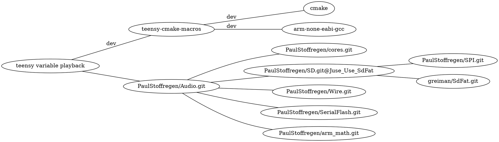

# variable rate playback for teensy audio library
[](https://www.pjrc.com/store/teensy41.html)
[](https://github.com/newdigate/teensy-variable-playback/actions/workflows/teensy41_lib.yml)
[](https://github.com/newdigate/teensy-variable-playback/actions)
[](LICENSE)
[](CMakelists.txt)
[](https://code.visualstudio.com/)

play 16-bit mono .raw and .wav audio at variable playback rates on teensy

## contents
* [requirements](#requirements)
* [code structure](#code-structure)
* [download](#download)
* [teensy build](#teensy-build)
* [linux build](#linux-build)
* [visual studio code](#visual-studio-code)
* [todo](#todo)

## requirements  
### teensy   
```cmake```, ```gcc-arm-none-eabi``` [^](https://developer.arm.com/-/media/Files/downloads/gnu-rm/9-2019q4/RC2.1), ```teensy-cmake-macros```, [^](https://github.com/newdigate/teensy-cmake-macros), ```cores``` [^](https://github.com/PaulStoffregen/cores), ```Audio``` [^](https://github.com/PaulStoffregen/Audio), ```SD``` [^](https://github.com/PaulStoffregen/SD/tree/Juse_Use_SdFat), ```Wire``` [^](https://github.com/PaulStoffregen/Wire), ```SPI``` [^](https://github.com/PaulStoffregen/SPI), ```SerialFlash``` [^](https://github.com/PaulStoffregen/SerialFlash), ```arm_math```[^](https://github.com/PaulStoffregen/arm_math), ```SDFat``` [^](https://github.com/greiman/SdFat)




### linux 
```cmake```, ```gcc or llvm```, ```teensy-x86-stubs``` [^](https://github.com/newdigate/teensy-x86-stubs), ```teensy-audio-x86-stubs``` [^](https://github.com/newdigate/teensy-audio-x86-stubs), ```teensy-x86-sd-stubs``` [^](https://github.com/newdigate/teensy-x86-sd-stubs), ```boost-test``` 

By using stub libraries, we can compile teensy code to native device architecture. To a certain extent, this allows sketches and libraries to be developed, debugged and unit-tested using linux, on your local device or a build server. In this case I have a few basic tests for the ResamplingSdReader class.
  * install boost unit-test library: 
    * linux: ```sudo apt-get install -yq libboost-test-dev```
    * macos: ```brew install boost```

## code structure
| folder | target             | description                                                                                                            |
|--------|--------------------|------------------------------------------------------------------------------------------------------------------------|
| ```examples```    | ```teensy/linux``` | basic example how to use  |
| ```src```    | ```teensy/linux``` | extends teensy audio library<br/> * adds ```AudioPlaySdRawResmp```<br/> * play raw audio at variable forward and backward playback rates     |
| ```test```   | ```linux```          | unit tests that run on linux |
  
## download 
### clone repo
``` sh
> git clone https://github.com/newdigate/teensy-variable-playback.git
> cd teensy-variable-playback
```

## teensy build
You don't need to download or install Teensyduino or Arduino to build the library or examples. Just clone the cores library and any dependencies to a common folder, denoted by ```DEPSPATH``` (in this case ```/home/nic/teensy_libraries```). 
* clone dependencies
``` sh
 > cd /home/nic/teensy_libraries
 > git clone https://github.com/PaulStoffregen/cores.git
 > git clone https://github.com/PaulStoffregen/Audio.git
 > git clone -b Juse_Use_SdFat https://github.com/PaulStoffregen/SD.git 
 > git clone https://github.com/PaulStoffregen/Wire.git
 > git clone https://github.com/PaulStoffregen/SPI.git
 > git clone https://github.com/PaulStoffregen/SerialFlash.git
 > git clone https://github.com/PaulStoffregen/arm_math.git
 > git clone https://github.com/greiman/SdFat.git
```
* update COMPILERPATH and DEPSPATH in ```cmake/toolchains/teensy41.cmake```
``` cmake
set(COMPILERPATH "/Applications/Arm/bin/")
set(DEPSPATH "/home/nic/teensy_libraries")
set(COREPATH "${DEPSPATH}/cores/teensy4/")
```

* build hex file
  * If you run the commands below from the root repository directory, it will build the teensy-variable-playback library and all the examples. 
  * If you run them from a sub-directory, it will build everything under the sub-directory. (You might need to adjust relative path in ```-DCMAKE_TOOLCHAIN_FILE:FILEPATH``` below)
``` sh
> cd /home/nic/teensy-variable-playback
> mkdir cmake-build-debug
> cd cmake-build-debug
> cmake -DCMAKE_BUILD_TYPE=Debug -DCMAKE_TOOLCHAIN_FILE:FILEPATH="../cmake/toolchains/teensy41.cmake" ..
> make
```

* for best performance, use SDXC UHS 30MB/sec Application Performance Class 2 (A2) class micro sd-card. 
  * [sd classes on wikipedia](https://en.wikipedia.org/wiki/SD_card#cite_ref-93) 

## linux build
### build tests on linux
``` sh
> ./build-linux.sh
```

### build tests on win
``` sh
> mkdir cmake-build-debug
> cd cmake-build-debug
> cmake -DCMAKE_BUILD_TYPE=Debug -DCMAKE_TOOLCHAIN_FILE:FILEPATH="../cmake/toolchains/linux.cmake" ..
> make
```

### run tests
``` sh
> cmake-build-debug/test/test_suite1
```

## visual studio code
  * download vs code
    * required extensions
      * ms-vscode.cpptools
    * optional extensions
      * ms-vscode.cmake-tools
      * hbenl.vscode-test-explorer
      * ms-vscode.test-adapter-converter
      * nicnewdigate.boost-test-adapter-debug
  * open root folder of repository in visual studio code
  * open terminal in visual studio code build, build as above
  * (add breakpoint)
  * launch

## todo
* stereo

## example usage
```c++
#include <Arduino.h>
#include <Audio.h>
#include "playarrayresmp.h"

// GUItool: begin automatically generated code
AudioPlayArrayResmp      rraw_a1;        //xy=321,513
AudioOutputI2S           i2s1;           //xy=675,518
AudioConnection          patchCord1(rraw_a1, 0, i2s1, 0);
AudioConnection          patchCord2(rraw_a1, 0, i2s1, 1);
AudioControlSGTL5000     sgtl5000_1;     //xy=521,588
// GUItool: end automatically generated code

unsigned char kick_raw[] = {
  0x99, 0x02, 0xd7, 0x02, 0xfa, 0x02, 0x5f, 0x03, 0xc1, 0x03, 0x2a, 0x04,
  0xad, 0x04, 0xa5, 0x05, 0x76, 0x06, 0x2f, 0x07, 0x9e, 0x07, 0xe2, 0x07,
  0x43, 0x08, 0x92, 0x08, 0xb2, 0x08, 0xe8, 0x08, 0x16, 0x09, 0xda, 0x08,
};
unsigned int kick_raw_len = 6350;

void setup() {
    AudioMemory(20);
    sgtl5000_1.enable();
    sgtl5000_1.volume(0.5f, 0.5f);
    rraw_a1.setPlaybackRate(0.5);
}

void loop() {
    if (!rraw_a1.isPlaying()) {
        delay(1000);
        rraw_a1.play((int16_t *)kick_raw, kick_raw_len/2);
    }
}
```
